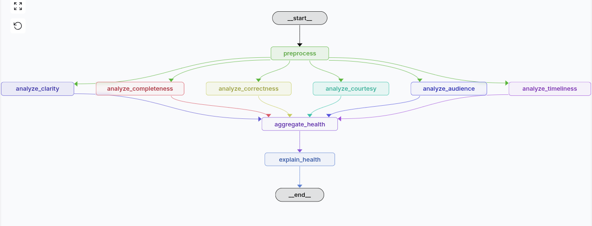

# Communication Health Analysis Agent via LangGraph

This repo contains a LangGraph workflow that analyzes communication health from emails and meeting transcripts, producing structured scoring across 6 key dimensions, providing important insights for communication  improvement.

## Overview

This implementation demonstrates **structured reasoning through a graph-based workflow** using LangGraph. The workflow uses LLM calls at multiple nodes to analyze communication quality, aggregate results, and generate analysis of the communacation health overall	.

## Graph Structure

The workflow is structured as a **LangGraph StateGraph** with the following architecture:



```
Input (Emails/Transcript)
    ↓
[preprocess] → Prepare content for analysis
    ↓
    ├─→ [analyze_clarity] (LLM) ──┐
    ├─→ [analyze_completeness] (LLM) ──┤
    ├─→ [analyze_correctness] (LLM) ──┤
    ├─→ [analyze_courtesy] (LLM) ─────┤
    ├─→ [analyze_audience] (LLM) ─────┤
    └─→ [analyze_timeliness] (LLM) ───┤
                                      ↓
                            [aggregate_health] → Consolidate scores (deterministic)
                                      ↓
                            [explain_health] (LLM) → Generate explanation
                                      ↓
                              Output (JSON + Explanation)
```

### Node Types

1. **Preprocessing Node** (Deterministic [Non LLM])

   - Handles email threads or meeting transcripts
   - Extracts metadata (participants, timestamps, speaker info)
   - Prepares unified content format
2. **Analysis Nodes** (6 parallel LLM nodes)

   - Each node makes an independent LLM call
   - Evaluates one dimension of communication health
   - Returns structured JSON: `{"score": float, "reasoning": str}`
3. **Aggregation Node** (Deterministic [Non LLM])

   - Waits for all 6 dimensions to complete
   - Calculates overall health score (unweighted average)
   - Consolidates dimension scores
4. **Explanation Node** (LLM)

   - Synthesizes all results into natural language
   - Provides actionable recommendations
   - Demonstrates LLM reasoning for interpretation

## Modeling Approach: Communication Health

### Why 6 Dimensions?

Communication health is modeled as a **multi-dimensional construct** because effective communication requires excellence across multiple domains:

1. **Clarity** - Is the message being understood?
2. **Completeness** - Is all necessary information present?
3. **Correctness** - Is the information accurate and coherent?
4. **Courtesy** - Is the tone appropriate and respectful?
5. **Audience-Centricity** - Is it tailored to the recipient?
6. **Timeliness** - Is it sent at the right time?

This framework captures both **content quality** (clarity, completeness, correctness) and **interpersonal effectiveness** (courtesy, audience, timeliness).

### Why Parallel Analysis?

The 6 analysis nodes run **in parallel** because:

- **Independence**: Each dimension can be evaluated independently
- **Performance**: Parallel execution reduces total analysis time
- **Scalability**: Easy to add more dimensions without restructuring
- **LangGraph Feature**: Demonstrates graph-based parallel execution

### LangGraph Benefits

LangGraph provides:

- **State Management**: Automatic handling of complex state transitions
- **Parallel Execution**: Built-in support for concurrent node execution
- **Visualization**: Can be visualized in LangGraph Studio
- **Error Handling**: Built-in mechanisms for workflow failures
- **Extensibility**: Easy to add conditional logic or feedback loops

### LLM at Multiple Nodes

LLMs are used at **7 nodes** (6 analysis + 1 explanation) because:

- **Specialized Reasoning**: Each dimension requires nuanced evaluation
- **Structured Output**: JSON parsing ensures consistent format
- **Interpretability**: Natural language reasoning for each score
- **Synthesis**: Final LLM call combines all insights into coherent explanation

This demonstrates **multi-step LLM reasoning** where each step builds on previous results.

## Communication Health Dimensions

### 1. Clarity (0.0-1.0)

**Factors:** Readability, directness, jargon usage, brevity

- **Excellent (0.8-1.0)**: Clear, direct, no jargon issues
- **Good (0.6-0.8)**: Mostly clear, minor improvements needed
- **Fair (0.4-0.6)**: Some clarity issues, needs revision
- **Poor (0.0-0.4)**: Unclear, confusing, requires significant revision

### 2. Completeness (0.0-1.0)

**Factors:** Sufficient information, actionable details, clear next steps

- **Excellent (0.8-1.0)**: All information present, no follow-up needed
- **Good (0.6-0.8)**: Most information present, minor gaps
- **Fair (0.4-0.6)**: Missing some important information
- **Poor (0.0-0.4)**: Critical information missing

### 3. Correctness (0.0-1.0)

**Factors:** Factual accuracy, grammar/spelling, logical flow, consistent tone

- **Excellent (0.8-1.0)**: No errors, perfect coherence
- **Good (0.6-0.8)**: Minor errors, mostly coherent
- **Fair (0.4-0.6)**: Some errors or coherence issues
- **Poor (0.0-0.4)**: Multiple errors, confusing flow

### 4. Courtesy (0.0-1.0)

**Factors:** Politeness, respect, empathy, professionalism

- **Excellent (0.8-1.0)**: Highly courteous, professional, empathetic
- **Good (0.6-0.8)**: Polite and professional
- **Fair (0.4-0.6)**: Adequate but could be more courteous
- **Poor (0.0-0.4)**: Discourteous, unprofessional

### 5. Audience-Centricity (0.0-1.0)

**Factors:** Relevance, appropriate knowledge level, personalization, context awareness

- **Excellent (0.8-1.0)**: Highly personalized, perfectly relevant
- **Good (0.6-0.8)**: Relevant and appropriately tailored
- **Fair (0.4-0.6)**: Somewhat relevant but generic
- **Poor (0.0-0.4)**: Not relevant or completely generic

### 6. Timeliness (0.0-1.0)

**Factors:** Appropriate timing, response delays, urgency handling, follow-up frequency

- **Excellent (0.8-1.0)**: Perfect timing, appropriate urgency
- **Good (0.6-0.8)**: Generally timely, minor timing issues
- **Fair (0.4-0.6)**: Some timing problems or urgency mismatch
- **Poor (0.0-0.4)**: Untimely, inappropriate urgency

## Example Output

When you run the workflow, it returns a structured JSON response with scores, reasoning, and a natural language explanation. Here's an example output:

```json
{
  "aggregated_health": {
    "overall": 0.75,
    "dimensions": {
      "clarity": 0.8,
      "completeness": 0.7,
      "correctness": 0.9,
      "courtesy": 0.75,
      "audience": 0.7,
      "timeliness": 0.65
    },
    "total_dimensions": 6
  },
  "communication_health_scores": {
    "clarity": {
      "score": 0.8,
      "reasoning": "The message is clear and direct, with minimal jargon. The main point is stated early and the language is accessible."
    },
    "completeness": {
      "score": 0.7,
      "reasoning": "Most essential information is present, including the topic and general context. However, specific timelines and actionable next steps could be more explicit."
    },
    "correctness": {
      "score": 0.9,
      "reasoning": "The communication is grammatically correct, logically coherent, and maintains a consistent professional tone throughout."
    },
    "courtesy": {
      "score": 0.75,
      "reasoning": "The tone is polite and professional, using appropriate language. Could benefit from more empathetic phrasing in certain sections."
    },
    "audience": {
      "score": 0.7,
      "reasoning": "The content is relevant to the recipient, but could be more personalized. The knowledge level is generally appropriate."
    },
    "timeliness": {
      "score": 0.65,
      "reasoning": "The communication was sent at a reasonable time, though the response delay was slightly longer than ideal for the urgency level indicated."
    }
  },
  "health_explanation": "Overall, this communication demonstrates strong clarity and correctness, with a professional tone that is appropriate for the context. The message effectively conveys its main points, though it could benefit from more specific details regarding timelines and next steps. The timeliness is adequate but could be improved for better responsiveness. Recommendations include: adding explicit deadlines or action items, personalizing the content further to the recipient's specific context, and ensuring faster response times for time-sensitive matters.",
  "status": "completed"
}
```

**Key Components:**
- **`aggregated_health`**: Overall score (average of all dimensions) and individual dimension scores
- **`communication_health_scores`**: Detailed scores with reasoning for each dimension
- **`health_explanation`**: Natural language summary generated by the LLM, providing actionable insights
- **`status`**: Workflow completion status

## To Run the Workflow in Langraph Studio:

### Option 1: Quick Start with Docker Hub (Recommended)

The easiest way to run this project is using the pre-built Docker image from Docker Hub. This eliminates all dependency issues and works identically on Windows, macOS, and Linux.

**Prerequisites:**

- [Docker](https://www.docker.com/get-started) installed
- `.env` file in your root folder

**Quick Start:**

1. **Create `.env` file** in your root (see Configuration section below)
2. **Pull and run the pre-built image:**

   ```bash
   docker pull ymzpe/communication-health:latest
   docker run -d -p 8123:8123 --env-file .env --name communication-health ymzpe/communication-health:latest
   ```
3. **Access LangGraph Studio:**

   - Open your browser to `http://localhost:8123`

**Or use Docker Compose with pre-built image:**

```bash
   # Update docker-compose.yml to use image instead of build (see docker-compose.yml comments)
   # Change 'build: .' to 'image: ymzpe/communication-health:latest'
   docker-compose up -d
```

**Stop the container:**

```bash
   docker stop communication-health
   docker rm communication-health
```

---

### Option 2: Build Locally with Docker

If you prefer to build the image yourself or make modifications:

**Prerequisites:**

- [Docker](https://www.docker.com/get-started) installed
- `.env` file in the root folder

**Build and run:**

```bash
# Build the image
docker build -t communication-health .

# Run the container
docker run -d -p 8123:8123 --env-file .env --name communication-health communication-health

# Or use docker-compose
docker-compose up --build
```

---

### Option 3: Local Python Installation

### Prerequisites

- **Python 3.9 or higher** (Python 3.10+ recommended)
- pip (Python package manager)

### Install Requirements

**Recommended: Use a virtual environment**

```bash
# Create virtual environment (optional but recommended)
python -m venv venv

# Activate virtual environment
# On Linux/macOS:
source venv/bin/activate
# On Windows:
# venv\Scripts\activate

# Install dependencies
pip install -r requirements.txt
```

**Or install directly:**

```bash
pip install -r requirements.txt
```

### Troubleshooting Installation Issues

If you encounter installation errors (especially on systems without Anaconda):

1. **Upgrade pip first:**

   ```bash
   pip install --upgrade pip setuptools wheel
   ```
2. **Install build tools (if needed):**

   - **Linux:** `sudo apt-get install build-essential python3-dev` (Ubuntu/Debian) or `sudo yum install gcc python3-devel` (RHEL/CentOS)
   - **macOS:** Install Xcode Command Line Tools: `xcode-select --install`
   - **Windows:** Install [Microsoft C++ Build Tools](https://visualstudio.microsoft.com/visual-cpp-build-tools/)
3. **If `langgraph dev` command not found:**

   - Ensure `langgraph-cli` is installed: `pip install langgraph-cli`
   - Verify installation: `langgraph --version`

## Configuration

A `.env` file is necessary for access of LLM (I will include a fully working .env file to be utilised for this demo):

Place the .env in the root path of this repo.

### Start the Langgraph Studio Server:

From the root of this repo, in the terminal (or command prompt on Windows), run:

```bash
langgraph dev
```

This will start the LangGraph Studio server. The interface will be available in your browser (typically at `http://localhost:8123`).

### Included Email and Meeting Transcription Samples

For the demonstration of this workflow, I've included sample emails and meetings in the expected JSON format.
They are in the folder: `examples/example_communication_files/`, e.g., `meeting_transcript_sample2.json`, `email_sample_3.json`.
To test the workflow, once in the Langgraph studio page, paste the entire contents of any of the JSON files
into the input bar, under the graph. The system will automatically determine if it is a meeting or an email. Press Submit.
Watch the analysis happen in real-time and check on any of the stages.
I will also include short video demonstrating the workflow.

## Design Decisions

### This Graph Structure Includes

1. **Preprocessing First**: Ensures consistent input format before analysis
2. **Parallel Analysis**: 6 dimensions analyzed simultaneously for efficiency
3. **Aggregation Before Explanation**: Explanation node needs complete scores
4. **Sequential Final Steps**: Aggregation → Explanation → End (logical flow)

## File Structure

```
var_comm_health/
├── var_comm_health/          # Python package
│   ├── __init__.py          # Module exports
│   ├── config.py            # Configuration management
│   ├── workflow.py          # LangGraph workflow (THIS IS THE CORE)
│   ├── analyzer.py          # Helper functions (optional, for standalone use)
│   ├── llm_factory.py       # LLM instance creation
│   └── langgraph_studio_server.py  # LangGraph Studio server entry point
├── examples/                # Example files and samples
│   ├── example_communication_files/  # Sample emails and transcripts
│   │   ├── email_samples/
│   │   └── transcribed_meetings/
│   └── graph.png           # Workflow visualization
├── langgraph.json          # LangGraph Studio configuration
├── requirements.txt        # Dependencies
├── Dockerfile              # Docker image definition
├── docker-compose.yml      # Docker Compose configuration
├── .dockerignore           # Files to exclude from Docker build
└── README.md              # This file
```

## Features

 **LangGraph Workflow**: Proper StateGraph with nodes and edges
 **LLM at Multiple Nodes**: 7 efficient LLM calls for specialized reasoning
 **Parallel Execution**: 6 dimensions analyzed simultaneously
 **Thread/Transcript Support**: Handles both input types natively
 **Structured Output**: JSON format with scores and reasoning
 **Natural Language Explanation**: LLM-generated summary
 **LLM USED:**: Uses DeepSeek v3.1-terminus via NVIDIA NIM

## Key Features

- **Product Thinking**: 6-dimension framework models communication health comprehensively
- **LangGraph Structure**: Proper StateGraph with clear node/edge relationships
- **Readability**: Clean code with type hints and documentation
- **Smart LLM Use**: Purposeful LLM calls at analysis and explanation nodes
